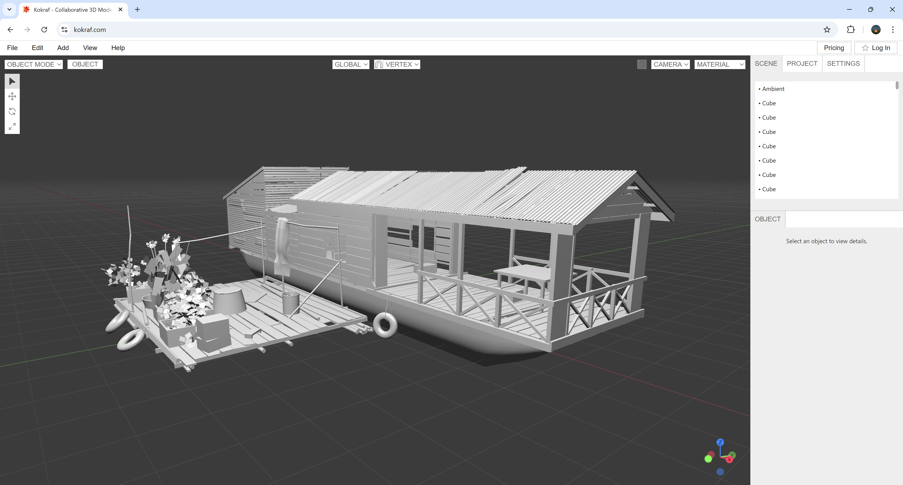

# Kokraf – 3D Modeling Application on the Web

Kokraf is a modern, browser-based 3D modeling tool built for real-time creativity. Whether you're a hobbyist, designer, or developer, Kokraf gives you a smooth, intuitive interface to model, manipulate, and view 3D objects directly in your browser — no installation needed.

[](https://youtu.be/hpA3I_OLDl4)
🎥 **Modeling Demo:** https://youtu.be/hpA3I_OLDl4

## 🚀 Live Demo

Try it live here: https://kokraf.com/  
*(Best viewed on a desktop browser like Chrome)*

[User Manual](https://kokraf.com/manual/) – Learn the tools and workflow

## 🛠️ Built With

- [Three.js](https://threejs.org/) – 3D rendering
- HTML, CSS, JavaScript
- Supabase - for backend
- GitHub Pages – for free hosting

## 🌟 Community

- Discord: [Join the community](https://discord.com/invite/FEkhTyggYq)
- YouTube: [Jourverse Channel](https://www.youtube.com/@jourverse)
- X: [Jourverse on X](https://x.com/jourverse)

## 🧰 Getting Started

To run this project locally on your PC:

```bash
git clone https://github.com/sengchor/kokraf.git
cd kokraf
```
Then open the project in Visual Studio Code.

Open `index.html` and use the **Live Server** extension to view the project in your browser.

## 🧩 Core Mesh Representation

Kokraf does not edit Three.js geometries directly. Instead, it uses a custom `Vertex–Edge–Face (VEF)` adjacency mesh as its core data model.

All modeling operations (extrude, move, split, etc.) operate on this mesh data. After each operation, the mesh is converted into a `BufferGeometry` and sent to Three.js purely for rendering.

This separation keeps modeling logic independent from the renderer, allows direct polygon (quad) representation, and supports real modeling workflows rather than render-only editing.